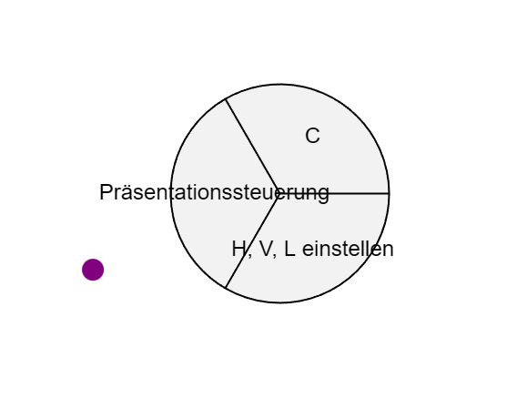
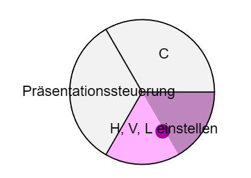
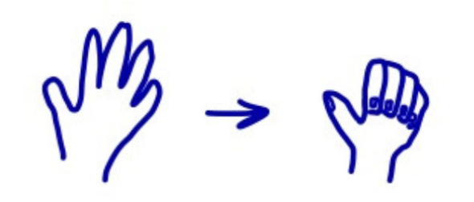
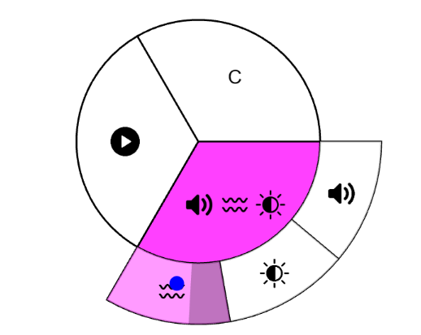
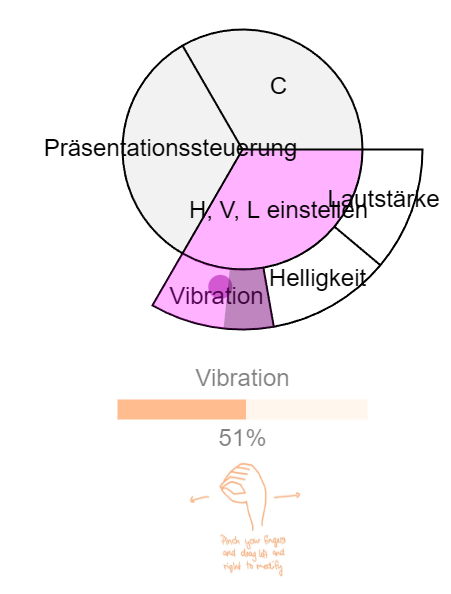
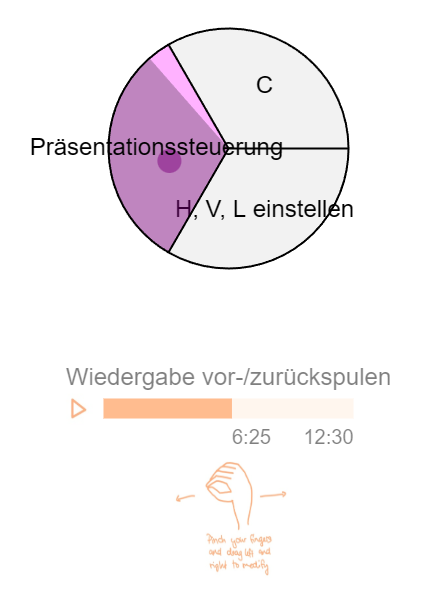
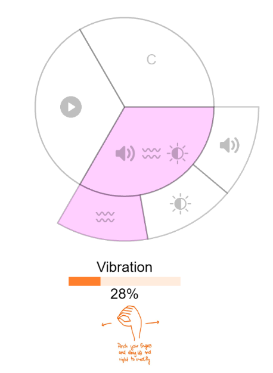
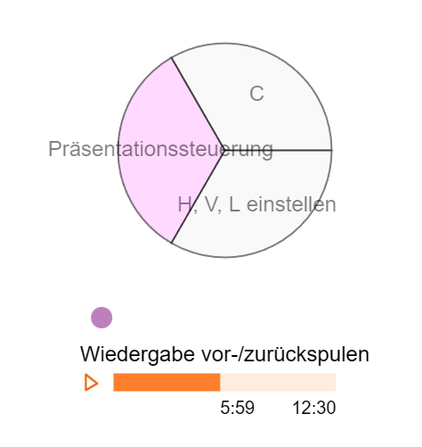

# gesture-interface-ma
This repository is set up to create an interface used in the MIR (https://www.htw-dresden.de/hochschule/fakultaeten/info-math/labore-und-lehrplattformen/mir) to enable gesture interaction with marking menus.

This project is a static web application and can be run locally using any simple web server.

## Features
### 1. HandDetection:
- Activation: If a hand was detected, a small dwell circle appears in the top right corner for 3s. If the user holds the hand, after this activation time, the menu + cursor appears.
- Cursor: If a hand was detected, a purple circle appears which is mapping the hands position to a cursor in the web frontend
- Menu: If a hand was detected, a circle menu structure appears with different segments that can be selected
- No hands detected: After 10 seconds of no hands detected, the menu is set to a faded state and a dwell timer starts. After this dwell timer finished, the menu disappears.
    

        

             
            Hovering over segment while hover animation fills segment
        

        

             
            Menu in faded state if after 10s no hands were detected
        

        

             
            Small dwell circle in top right corner of application
        

    

### 2. Menu selection:
#### Selection: 
- If the user navigates the hand in a segment he wants so select, this segment is highlighted in a color, confirming that the cursor is detected in this segment

#### Selection Confirmation: 
- The user can now hold the hand there until the segments fill animation (3s) is finished
- To skip the fill animation, the user can also perform a "Grab" gesture
- after a confirmed selection, there are two options: 
  1. a submenu is opened (can be controlled the same way as the main menu)
  2. an action is performed (in this case, a preview of the selected action becomes visible - if available)

   

       

            
           Hovering over segment with dwell time hover animation
       

   

        
           Gesture to skip the dwell time
       

   

        
           Submenu Interaction
       

   

### 3. Actions:
- If an "leaf" menu item was selected, the system executes an action
- Possible actions: 
  - sliders for vibration intensity, brightness, volume and a slider for presentation steering
  - if available, hovering over an item with an action shows a preview
  - the position of the sliders is currently static
  
   

       

            
           Leaf menu item  shows preview of action: vibration intensity
       

   

        
           Presentation steering slider
       

   

### 4. Interaction with sliders
- If the user wants to interact with a slider, he has to navigate the cursor in the slider area (or just outside the menu) until its opacity is changing to 1.
- If the user can now perform the displayed pinch gesture and move their hand to modify the slider value. To stop modifying the value, the user just opens the palm.
- With an open palm, the user can also navigate the cursor back to the menu and select other menu items - BUT as long as no selection was confirmed, the slider still remains open to prevent accidental slider closing.
- Currently, the slider values are not saved independently (so if you modify one value, all values for different slider types are modified) -> this will be fixed by adding the external systems for the real value modifications.

   

       

            
           Leaf menu item  shows preview of action: vibration intensity
       

   

        
           Presentation steering slider in action
       

   
