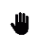
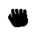
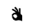

# gesture-interface-ma
This repository is set up to create an interface used in the MIR (https://www.htw-dresden.de/hochschule/fakultaeten/info-math/labore-und-lehrplattformen/mir) to enable gesture interaction with marking menus.

## Start application
### Option a: Web
This project is a static web application and can be run locally using any simple web server.
It is also deployed using github pages: https://selinanatschke.github.io/gesture-interface-ma/.
This method uses offline dummy data without responses from neither a real server nor a dummy server. 

### Option b1: Electron
You can run the electron application by typing these commands in the command line:
```cd electron-app``` and then ```npm run start ```

This method uses offline dummy data without responses from neither a real server nor a dummy server.

### Option b2: Electron + Dummy Server
To start the dummy server you have to type these commands in the command line:
```cd electron-app``` and then ```node mock-unreal-server.js```

Then you can now start the electron server with these commands (in the same folder as before):
```npm run start ```

This method enables real responses from a dummy server that simulate real messages from the UE server. 

## Features
### 1. HandDetection:
- Initial state: In the top right corner, a hand image appears which is faded if no hand was detected, or black if a hand was detected. 
- Activation: If a hand with the activation gesture (open palm) was detected, a small dwell circle appears in the top right corner for 3s. If the user holds the activation gesture, after this activation time, the menu + cursor appears.
- Cursor: If a hand was detected, a blue circle appears which is mapping the hands position to a cursor in the web frontend
- Menu: If a hand was detected, a circle menu structure appears with different segments that can be selected (see below)
- No hands detected: After 3 seconds of no hands detected, the menu is set to a faded state and a dwell timer starts. After this dwell timer finished, the menu disappears.
    <div style="display: flex; gap: 20px; margin: 20px 0;">
        <div>
            <br>
            <sub>Hand symbol faded (no hand was detected)</sub>
        </div>
        <div>
            <br>
            <sub>Hovering over segment while hover animation fills segment</sub>
        </div>
        <div>
            <br>
            <sub>Menu in faded state if after 10s no hands were detected</sub>
        </div>
        <div>
            <br>
            <sub>Small dwell circle in top right corner of application</sub>
        </div>
    </div>

### 2. Menu selection:
#### Selection: 
- If the user navigates the hand in a segment he wants so select, this segment is highlighted in a color, confirming that the cursor is detected in this segment

#### Selection Confirmation: 
- The user can now hold the hand there until the segments fill animation (3s) is finished
- To skip the fill animation, the user can also perform a "Grab" gesture
- after a confirmed selection the segment is highlighted in a darker color and there are two options: 
  1. a submenu is opened (can be controlled the same way as the main menu)
  2. an action is performed (in this case, a preview of the selected action becomes visible - if available)

   <div style="display: flex; gap: 20px; margin: 20px 0;">
       <div>
           <br>
           <sub>Hovering over segment with dwell time hover animation</sub>
       </div>
   <div>
       <br>
           <sub>Gesture to skip the dwell time</sub>
       </div>
   <div>
       <br>
           <sub>Submenu Interaction</sub>
       </div>
   </div>

### 3. Actions:
- If a "leaf" menu item was selected, the system executes an action
- Possible actions: 
  - sliders for vibration intensity, brightness, volume and a slider for presentation steering
  - if available, hovering over an item with an action shows a preview
  - the position of the sliders is calculated by the middle of the main menu item that opened the slider. It can be top, bottom, left or right
  
   <div style="display: flex; gap: 20px; margin: 20px 0;">
       <div>
           <br>
           <sub>Leaf menu item  shows preview of action: vibration intensity</sub>
       </div>
   <div>
       <br>
           <sub>Presentation steering slider</sub>
       </div>
   </div>

### 4. Interaction with sliders
- After a confirmed selection of a menu item that has a slider action, the slider is focused (opacity=1), the menu appears faded and the cursor disappears. 
- If the user can now perform the displayed pinch gesture and move their hand to modify the slider value. To stop modifying the value, the user just opens the palm.

   <div style="display: flex; gap: 20px; margin: 20px 0;">
       <div>
           <br>
           <sub>Leaf menu item  shows preview of action: vibration intensity</sub>
       </div>
   <div>
       <br>
           <sub>Presentation steering slider in action</sub>
       </div>
   </div>

### 5. Gestures
- Sometimes it can be difficult for the user to understand when gestures are detected by the system. Therefore in the top right corner, the hand symbol changes depending on the detected gesture.
   <div style="display: flex; gap: 20px; margin: 20px 0;">
       <div>
           <br>
           <sub>No hand was detected</sub>
       </div>
       <div>
           <br>
           <sub>Hand was detected without gesture OR activation gesture (only relevant for activation time and then the dwell circle appears as a confirmation for open palm detection)</sub>
       </div>
       <div>
           <br>
           <sub>Grab gesture was detected</sub>
       </div>
       <div>
           <br>
           <sub>Pinch gesture was detected</sub>
       </div>
   </div>
  

# Ressources 
- some of the icons from the menu are from https://www.flaticon.com/free-icons