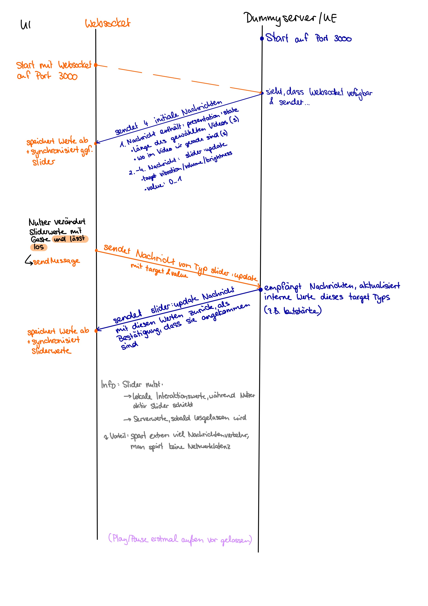

# WebSocket Protocol Specification

## General
- Transport: WebSocket (JSON)
- Values normalized to 0.0 – 1.0 unless stated otherwise

---
### Message Structure

#### General structure
Sent from UI to UE (and back as confirmation) when a slider value changes or the user interacts with UI components to pause/play video.

```json
{
  "action": "update | pressed | initial",
  "type": "slider | button",
  "target": "volume | brightness | vibration | presentation",
  "value": "0.0 - 1.0 | play | pause | number in s"
}
```

#### Examples
Example for a slider update message: The user has changed the volume slider value to 35%.
```json
{
  "action": "update",
  "type": "slider",
  "target": "volume",
  "value": "0.35"
}
```

Example for a slider update message: The user has changed the current time of the video to 1:20min of a total length of 2:00min.
```json
{
  "action": "update",
  "type": "slider",
  "target": "presentation",
  "value": "80"
}
```

Example for the initial message that is sent from the application to the frontend to clarify how long the video is. 
In this case ```value``` is stating the total length of the video (2:00min). 
```json
{
  "action": "initial",
  "type": "slider",
  "target": "presentation",
  "value": "120"
}
```

Example for a message that was sent if the user hits pause/play. 
Since the value now is play, it means that this should set the video in a running state.
```json
{
  "action": "pressed",
  "type": "button",
  "target": "presentation",
  "value": "play"
}
```

### Communication Diagram

   <div style="display: flex; gap: 20px; margin: 20px 0;">
       <div>
           <br>
           <sub>Diagram of how communication between User Interface (UI) and Dummy Server/Unreal Engine would work. Play/Pause is not visualized yet.</sub>
       </div>
   </div>